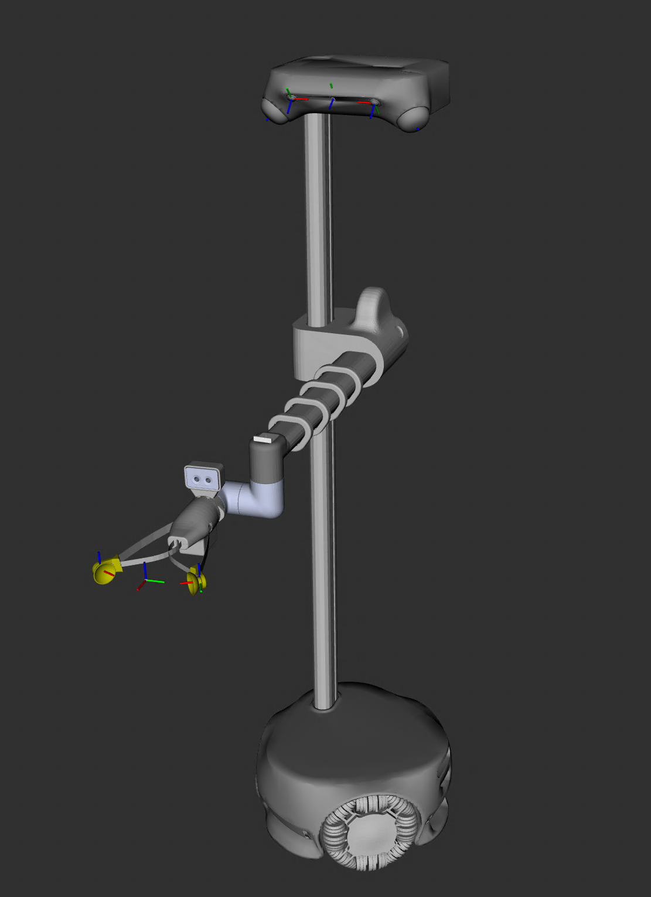
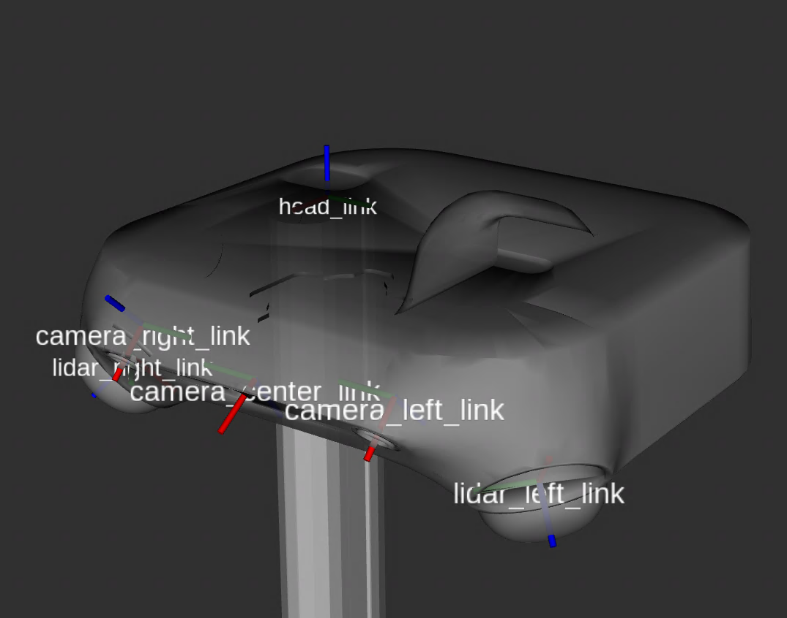
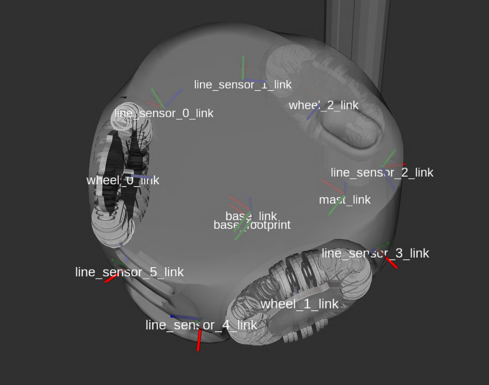
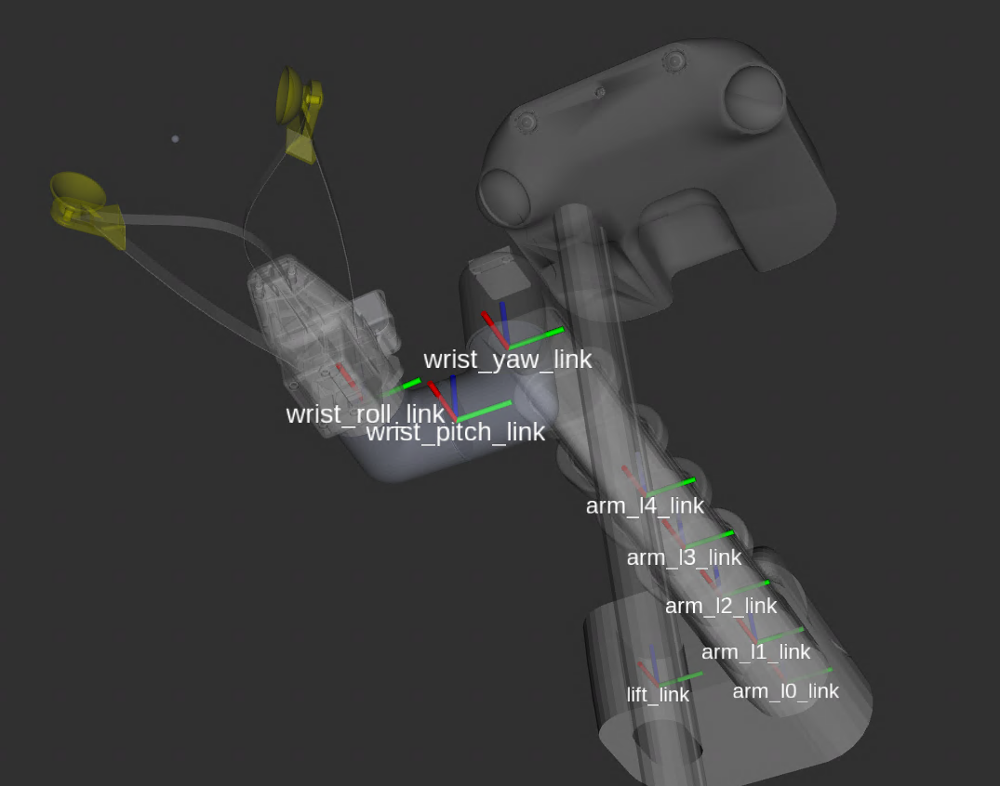
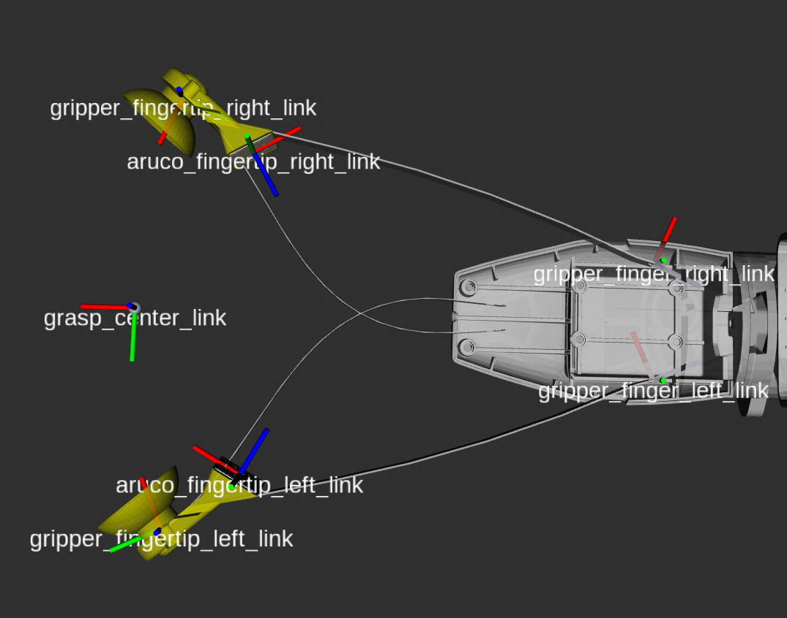

# Overview

This package provides robot description and mesh files for Stretch 4, as well as code for manipulating the kinematic description (e.g. adding virtual joints) and exporting for use in other programs (e.g. ROS2, pinocchio). The repository for Stretch 3 and earlier hardware versions can be found in [stretch_urdf](https://github.com/hello-robot/stretch_urdf). This package can be installed by:

```
python3 -m pip install -U hello-robot-stretch4-urdf
```

<p align="center">
    
</p>

<p align="center">
  
  
  <br>
  
  
</p>

## Details

The URDF and meshes are installed to your Python site directory. You can load them dynamically using:

```python
from stretch4_urdf import get_urdf

# configure the specifications for your robot
model_name = "SE4"
batch_name = "francis"
tool_name = "eoa_wrist_dw4_tool_sg4"

print(get_urdf(
    model_name=model_name,
    batch_name=batch_name,
    tool_name=tool_name,
))
```

Currently supported options for the `model_name`, `batch_name`, and `tool_name` are:

```python
supported_model_names = ["SE4"]
supported_batch_names = ["francis"]
supported_tool_names = ["eoa_wrist_dw4_tool_sg4"]
```

A single composable xacro combines a robot's base model with its attached tool. Util functions will handle processing the xacro file and return the URDF for the robot's current configuration:

```python
from stretch4_urdf import get_urdf_from_robot_params
urdf_string = get_urdf_from_robot_params() # store the urdf contents in a str variable
urdf_filepath = get_urdf_from_robot_params(out_dir="/tmp") # save the urdf to a file in the /tmp directory
```

## Bringing in URDF's from CAD

The package follows a strict directory strucutre:

```yaml
> {model}_{batch}
    > meshes
        visual and collision mesh STL files
    > xacro
        stretch_main.xacro
```

```yaml
> {model}_tools
    > {tool_name}
        > meshes
            visual and collision mesh STL files
        {tool_name}.urdf
```

The URDF and meshes from the CAD model are added to the {model}\_{batch} base directory and meshes folder. From there, `utils/preprocessing/process_new_robot_model.py` creates the stretch_main.xacro file and necessary collision meshes for the batch. See the urdf_conventions.md for the specifics of this processing step.

A directory is created for each new tool, with the urdf in the base directory and a folder for meshes. `utils/preprocessing/process_new_tool.py` is then used to add the necessary edits to the urdf and generate collision meshes.

## Documentation

The following files provide deeper documentation on various parts of the system:

| Primer                                                    | Description                                                                                               |
| :-------------------------------------------------------- | :-------------------------------------------------------------------------------------------------------- |
| [Batches](stretch4_urdf/batches.md)                       | Explains URDF batch organization, compiling the URDF dynamically, and how to add new batch models.        |
| [End Effectors](stretch4_urdf/SE4_tools/end_effectors.md) | Outlines the available end effector tools and provides instructions on how to add new tools to the robot. |
| [URDF Conventions](./urdf_conventions.md)                 | Outlines which conventions are used in the Stretch 4 URDF.                                                |
