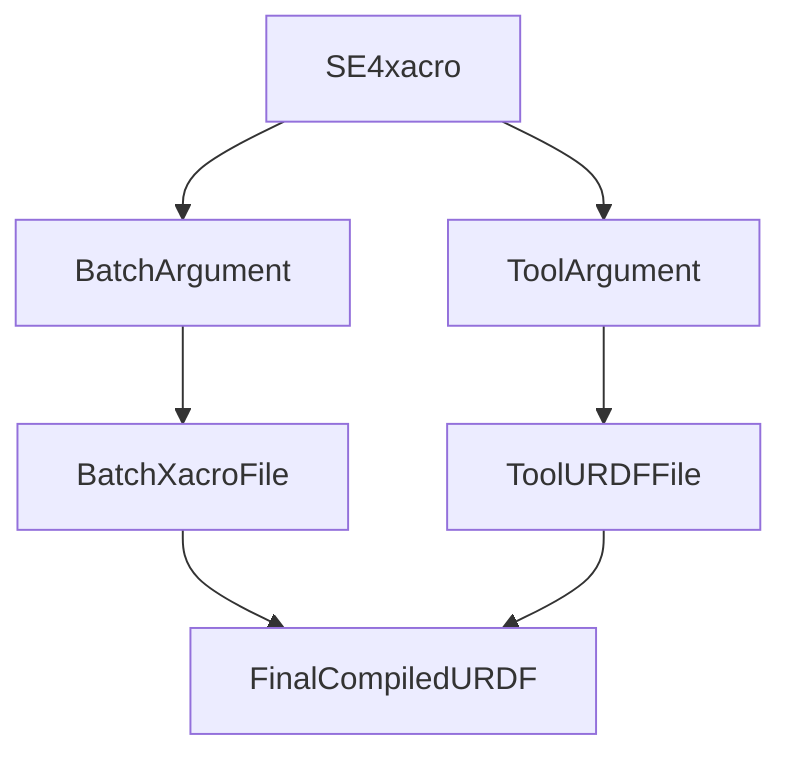

# URDF Batch Organization

We do batch production, and minor changes are introduced batch to batch. Most are internal or only affect cosmetics, but if there are kinematic changes, those will be flagged clearly in this markdown file. Most batches only see mesh changes.

## Known Batches and Kinematic Changes

- **francis**: Initial batch. No kinematic changes from baseline SE4.

## Organization

The folder organization separates the base configurations from batch-specific assets and end-of-arm tools:

- `SE4_francis/`: Contains the meshes and specific `stretch_main.xacro` for the `francis` batch.
- `SE4_tools/`: Contains available tools for the SE4 model.

## Getting a URDF

### Compiling `SE4.xacro`

The top-level `SE4.xacro` file determines which set of xacros to compile into a URDF. It requires two primary arguments: `batch` and `tool`.



When `SE4.xacro` runs, it dynamically includes the `stretch_main.xacro` from the directory specified by the `batch` argument. It also optionally includes a tool URDF from the `SE4_tools` directory based on the `tool` argument.

The tool is chosen strictly through the `tool` parameter passed to the xacro compiler. Details regarding specific tools and their geometries will be covered in a separate primer.

### `get_urdf()` Utility Function

The repository provides utility functions to streamline generating and loading URDFs in 3rd party applications.

#### Key Python Functions

- `get_urdf`: Takes the model name, batch name, and tool name as arguments to compile `SE4.xacro` and generate the raw URDF string dynamically.
- `get_urdf_from_robot_params`: Designed for use on the robot itself. It reads the specific model, batch, and tool directly from the `stretch4_body` system parameters and returns the compiled URDF.
- `generate_ik_urdfs`: Creates simplified URDFs specifically meant for Inverse Kinematics solvers by stripping unnecessary collision meshes and visuals.

#### Why Package as a Python Package?

Packaging these URDF assets and xacro files as a Python package is a deliberate design choice to encourage dynamic loading.

Codebases and 3rd party applications should load the URDF dynamically using the provided utility functions rather than bundling static URDF assets directly. This is a good idea because:

1. **Always Up-to-Date**: By generating the URDF dynamically, applications automatically inherit the latest cosmetic and kinematic changes corresponding to the robot's specific batch.
2. **Eliminates Stale Assets**: Bundling static URDF files in downstream repositories quickly leads to out-of-date assets that do not reflect the physical robot being used.
3. **Simplicity**: The Python utility functions handle the complexity of resolving absolute file paths for meshes and running the xacro parser, leaving the downstream application with a clean, fully-formed URDF string ready for use.

## Adding a New Batch

Hello Robot engineers can use the `process_new_robot_model.py` script located at the root of the repository to process new batch models exported from Solidworks into the appropriate Xacro format.

### How to Use `process_new_robot_model.py`

1. **Export the URDF**: Export the new robot batch model from Solidworks as a raw `.urdf` file.
2. **Create the Batch Folder**: Create a new folder under `stretch4_urdf/` following the naming convention `Model_batch` (e.g., `SE4_newbatch`).
3. **Add the Assets**: Place the exported `.urdf` file and its associated `meshes/` folder directly inside this new batch folder.
4. **Run the Script**: Execute the script from the root of the repository:
   ```bash
   python process_new_robot_model.py
   ```
   The script is interactive. It will list all available batch folders containing a raw `.urdf` file and prompt you to select which one(s) to process.

### What the Script Does

Once a batch is selected, the script automates the conversion process:

1. **Generates Collision Meshes**: It runs `generate_collision_mesh.py` to automatically generate convex hull collision meshes from the visual geometries.
2. **Creates the Xacro File**: It creates an `xacro/` subdirectory within the batch folder and copies the raw `.urdf` into it as `stretch_main.xacro`.
3. **Applies Collision Geometries**: It updates the new `stretch_main.xacro` to point to the newly generated collision meshes (replacing visual meshes in collision tags where appropriate) and explicitly removes collision geometry from optical links.
4. **Parameterizes Mesh Paths**: It modifies the mesh filepaths inside the `stretch_main.xacro` file to use the dynamic variable `$(arg model_mesh_dir)`. This allows `SE4.xacro` to properly resolve the absolute paths at compile time.
5. **Sets up the Xacro Namespace**: It replaces the standard URDF `<robot>` tag with the proper `<robot xmlns:xacro...>` definition to make it a valid xacro file.
