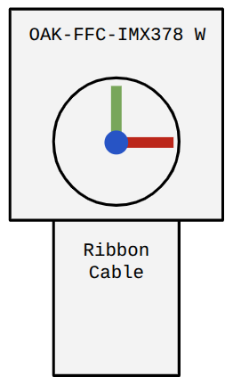
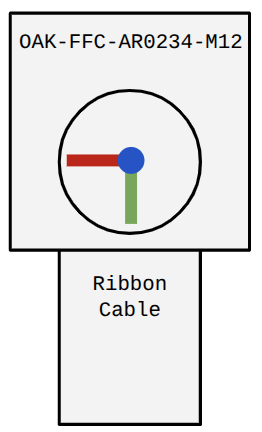
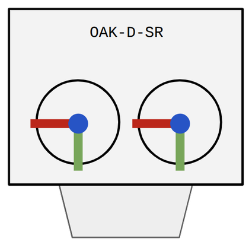
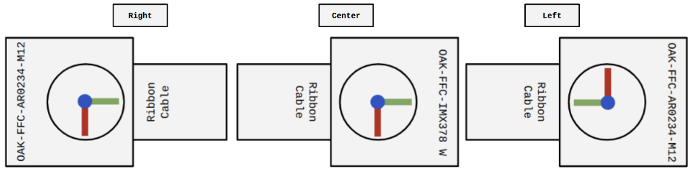
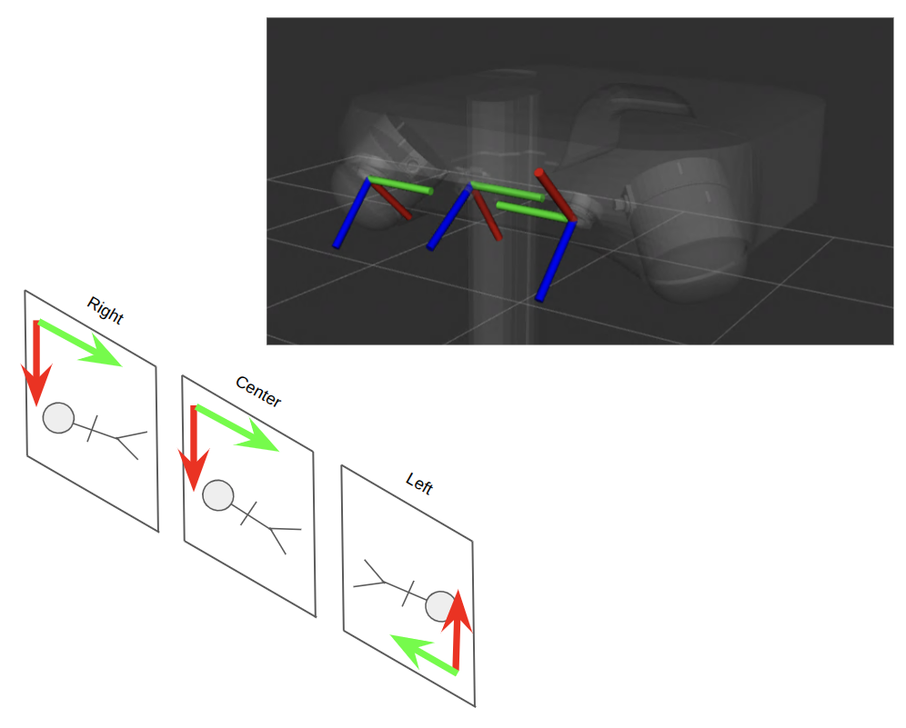

# Primer: Camera Orientations and Coordinate Conventions

The intention of this document is to define the sensor frame orientations of the three RGB camera modules used on Stretch 4, especially as it relates to the 2D pixel space of each image. 

---

## Stretch 4 Camera Modules

The Stretch 4 platform uses 3 distinct camera modules, each with their own optical frame definition. This optical frame is important when relating the raw sensor image to the robot's world frame. In 2D pixel space, looking through the camera lenses, the image origin is in the top left corner, with the horizontal axis, U, spanning from left to right and a vertical axis, V, spanning from top to bottom.

| Center Camera (OAK-FFC-IMX378 W) | Left/Right Head Camera (OAK-FFC-AR0234-M12) | Wrist Camera (OAK-D-SR) |
| :---: | :---: | :---: |
| Ribbon cable points to the top of the sensor image (-V) | Ribbon cable points to the bottom of the sensor image (+V) | A multi-sensor camera with off the shelf housing. Sensor image aligns with the mounting orientation.|
|  |  |  |

## Stretch 4 Head Camera Mounting Orientation 

The 3 head cameras are mounted in the following orientations:

# Pixel Projection 

Documentation on projecting a pixel coordinate from 2D to 3D space can be found [here](https://docs.opencv.org/4.13.0/d5/d1f/calib3d_solvePnP.html). The frames of stretch 4 are defined with standard graphical conventions such that the raw image may be used with standard libraries such as OpenCV to compute poses relative to the robot's body. 

